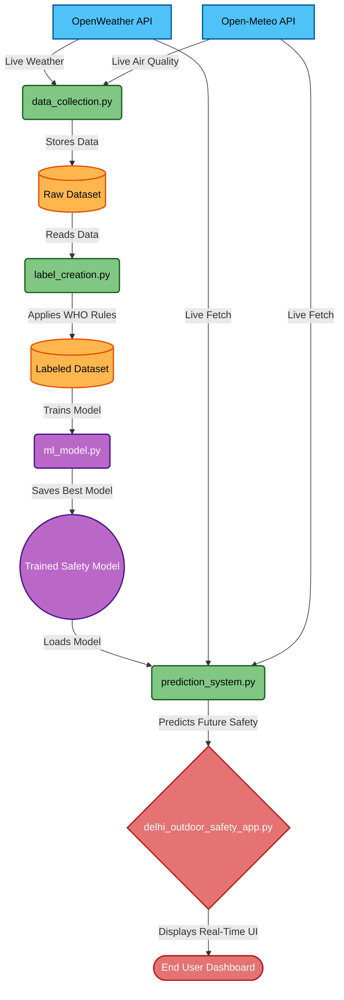

<div align="center">
  <h1>🌍 Delhi Outdoor Safety Prediction System</h1>
  <h3><i>Machine Learning-Driven Public Health Decision System</i></h3>
  <p>An intelligent, real-time application that protects public health by predicting whether it is safe to go outdoors in Delhi based on live environmental and weather data.</p>
</div>

---

##  Welcome to the Project!

Delhi faces complex environmental challenges due to air pollution and extreme weather. **This project solves a real-world problem** by collecting live weather and air quality data, evaluating it against World Health Organization (WHO) and Indian health guidelines, and using **Machine Learning** to safely predict outdoor conditions. 

If you are a recruiter or developer exploring this repository, you will find a complete end-to-end data pipeline—from live data ingestion and automated labeling to ML model training and a premium web dashboard.

## 🎯 Key Features

- **🌐 Live Data Integration**: Connects to *OpenWeather API* and *Open-Meteo* to fetch real-time data automatically.
- **🧠 Machine Learning Engine**: Uses high-accuracy classification models (like Random Forest and Gradient Boosting) to forecast safety.
- **⚕️ Health-Based Standards**: Labels environmental conditions (Safe/Unsafe) using strict WHO guidelines for PM2.5, PM10, AQI, CO, NO2, O3, and Temperature.
- ** Interactive Premium Dashboard**: A beautiful, 100% responsive Streamlit web app with dynamic UI, gauges, maps, and historical analytics.
- **🛠️ End-to-End Pipeline**: Includes complete automated scripts for data collection, labeling, training, and real-time prediction.

---

## 🏗️ System Architecture

This project is built using a clean, scalable architecture that separates data collection, processing, and the user interfaces.



---

## 📂 Project Structure

Here is how the project is organized. Each script represents a step in the Machine Learning pipeline:

1. **`data_collection.py`**: Fetches historical and live data from the APIs and saves it as a CSV.
2. **`label_creation.py`**: Reads the raw data, applies strict health rules, and creates the target variable (`outdoor_safe` = YES/NO).
3. **`ml_model.py`**: Trains multiple ML algorithms, tests their accuracy, plots feature importance, and saves the best model (`.pkl` file).
4. **`prediction_system.py`**: A standalone script that loads the saved model and live API data to make instant safety predictions.
5. **`delhi_outdoor_safety_app.py`**: The main Streamlit application providing a stunning Visual Dashboard for users to interact with.

---

## 🛠️ Technology Stack

- **Language:** Python 3.x
- **Frontend / UI:** Streamlit (with Custom HTML/CSS & Plotly)
- **Machine Learning:** Scikit-Learn (Random Forest, Gradient Boosting, Logistic Regression)
- **Data Manipulation:** Pandas, NumPy
- **APIs Used:** OpenWeather API, Open-Meteo, OpenAQ

---

## 💻 How to Run the Project

Follow these steps to run the application on your own machine.

### 1. Install Dependencies
Make sure you have Python installed, then run:
```bash
pip install streamlit pandas numpy scikit-learn plotly requests openmeteo-requests requests-cache retry-requests
```

### 2. Run the Machine Learning Pipeline (Optional but Recommended)
If you want to train the model from scratch on your own machine:
```bash
# Step 1: Collect Environmental Data
python data_collection.py

# Step 2: Create Safety Labels (Safe/Unsafe)
python label_creation.py

# Step 3: Train the Machine Learning Model
python ml_model.py
```

### 3. Start the Web Dashboard
After the model is trained, start the interactive Streamlit app:
```bash
streamlit run delhi_outdoor_safety_app.py
```

*Note: The app will ask for an OpenWeather API Key to fetch live data. You can get one for free at [openweathermap.org](https://openweathermap.org/).*

---

## 📈 Machine Learning Details

The system automatically compares multiple algorithms to find the best fit for predicting safety. The model is evaluated using **Accuracy, Precision, Recall, F1-Score, and AUC (Area Under Curve)**. 

During training, the `ml_model.py` script also generates a **Feature Importance Plot**, which helps us understand which environmental factors (like PM2.5 or Temperature) have the biggest impact on outdoor safety in Delhi.

---

<div align="center">
  <p><b>Built with ❤️ as part of an Advanced Machine Learning Project.</b></p>
  <p><i>Protecting health through data-driven decisions!</i></p>
</div>
